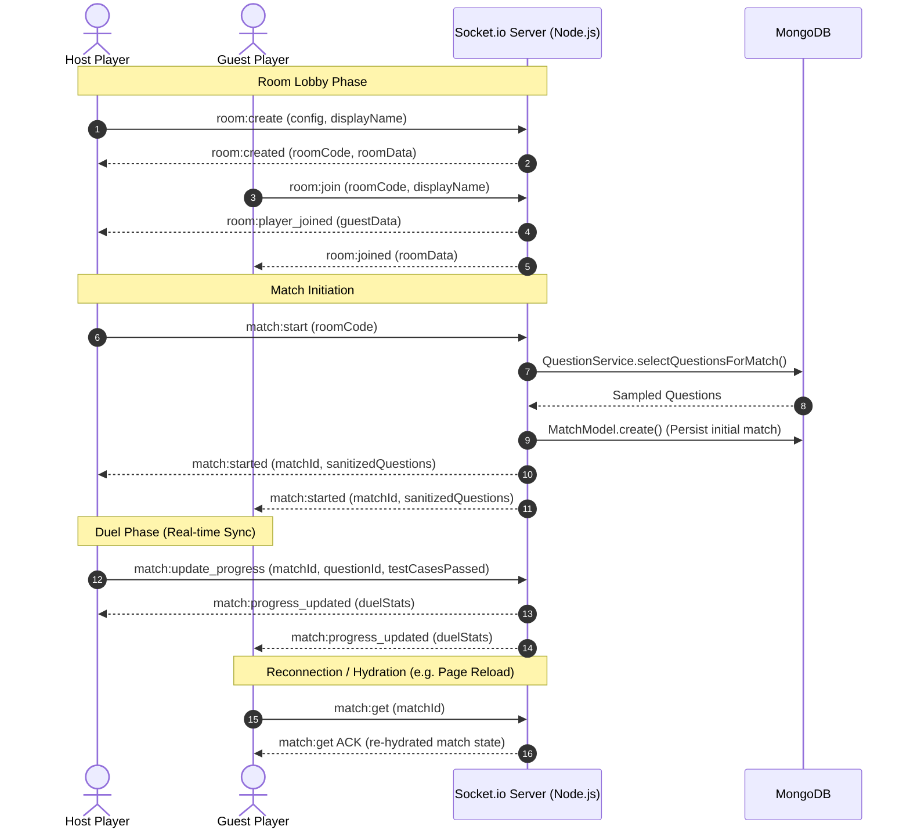

# ⚡ AlgoDuel (DSA Versus)

> **A real-time, 1v1 multiplayer competitive coding platform where developers battle head-to-head solving Data Structures & Algorithms challenges.**


---

## 📖 Table of Contents

- [Overview](#-overview)
- [Key Features](#-key-features)
- [System Architecture](#-system-architecture)
- [WebSocket Lifecycle & Event Protocol](#-websocket-lifecycle--event-protocol)
- [Judge0 Code Execution Architecture (Planned)](#-judge0-code-execution-architecture-planned)
- [Database Schema & State Management](#-database-schema--state-management)
- [Tech Stack](#-tech-stack)
- [Project Directory Structure](#-project-directory-structure)
- [Getting Started](#-getting-started)
  - [Prerequisites](#prerequisites)
  - [Backend Setup](#1-backend-setup)
  - [Frontend Setup](#2-frontend-setup)
  - [Dataset Seeding](#3-dataset-seeding-optional)
- [Roadmap](#-roadmap)

---

## 🎯 Overview

**AlgoDuel** brings the excitement of esports to competitive programming. Two programmers enter an arena, receive algorithmic challenges matching custom configurations (difficulty, topics, time constraints), and race against the clock to pass all test cases first.

The platform provides a browser-based, IDE-grade coding experience powered by Monaco Editor, synchronized over an ultra-low-latency WebSocket infrastructure.

---

## ✨ Key Features

- **⚔️ 1v1 Real-Time Matchmaking:** Create custom rooms with nano-id join codes, customize problem counts, topic tags, and battle durations.
- **💻 Full IDE Experience:** Monaco Code Editor with multi-language syntax highlighting, boilerplates, and keyboard shortcuts for **Python, C++, and Java**.
- **🎛️ Resizable Multi-Pane Layout:** Drag-and-drop panel resizing (`react-resizable-panels`) for problem descriptions, code editors, and test consoles.
- **🧪 Interactive Test Suite:** Run sample test cases or construct dynamic custom test cases with immediate feedback.
- **🛡️ Anti-Cheat Test Case Sanitization:** Server-side separation of public sample test cases and private evaluation test cases; private test cases are never exposed in client payloads.
- **⚡ In-Memory State Machine with DB Persistence:** Sub-second duel state updates in memory (`RoomManager`, `MatchManager`), backed by persistent MongoDB storage.
- **🔄 Fault-Tolerant Reconnection:** Match hydration protocol allows players to refresh or recover disconnected sockets without losing game state or editor buffers.

---

## 🏗️ System Architecture

```
┌─────────────────────────────────────────────────────────────┐
│                       Client (Browser)                      │
│   React 19 + TypeScript + Vite + Tailwind CSS v4 + Monaco   │
└──────────────┬───────────────────────────────▲──────────────┘
               │                               │
       HTTP / REST API                  WebSocket (Socket.io)
     (Auth, User Profile)            (Rooms, Matches, Progress)
               │                               │
┌──────────────▼───────────────────────────────┴──────────────┐
│                    Node.js / Express Server                 │
│                                                             │
│   ┌─────────────────────────────────────────────────────┐   │
│   │               Socket.io Event Gateway               │   │
│   │        (room.handler.ts, match.handler.ts)          │   │
│   └──────────┬───────────────────────────────▲──────────┘   │
│              │                               │              │
│   ┌──────────▼──────────────┐ ┌──────────────┴──────────┐   │
│   │       RoomManager       │ │       MatchManager      │   │
│   │   (In-Memory Lobbies)   │ │  (In-Memory Active Duels│   │
│   └──────────┬──────────────┘ └──────────────┬──────────┘   │
│              │                               │              │
│   ┌──────────▼───────────────────────────────▼──────────┐   │
│   │                 Question Service                    │   │
│   │         (MongoDB Aggregation & Sampling)            │   │
│   └──────────────────────────┬──────────────────────────┘   │
└──────────────────────────────┼──────────────────────────────┘
                               │
               ┌───────────────┴───────────────┐
               ▼                               ▼
     ┌───────────────────┐           ┌───────────────────┐
     │  MongoDB Database │           │ Judge0 CE Sandbox │
     │ (Users, Matches,  │           │   (Planned RCE)   │
     │  Questions, Seeds)│           │ (Isolated Docker) │
     └───────────────────┘           └───────────────────┘
```

### Architectural Highlights

1. **Hybrid State Architecture:**
   - **In-Memory Store (`RoomManager` & `MatchManager`):** Manages hot state (lobby rosters, active duel test case tallies, socket ID mappings) to avoid database bottlenecks during high-frequency typing or test runs.
   - **MongoDB Persistence:** Persists user authentication data, questions, and final match history for player profiles and analytics.
2. **Domain-Driven Socket Handlers:** Socket logic is strictly separated into `room.handler.ts` (creation, join, leave, ready status) and `match.handler.ts` (match start, progress synchronization, match hydration).

---

## 🔌 WebSocket Lifecycle & Event Protocol

Communication between duelists and the server follows a strict real-time protocol:



### Socket Event Reference

| Event Name | Direction | Payload | Description |
|---|---|---|---|
| `room:create` | Client ➔ Server | `{ config, displayName }` | Creates a new room lobby with custom parameters. |
| `room:join` | Client ➔ Server | `{ code, displayName }` | Joins an existing room lobby via room code. |
| `room:player_joined` | Server ➔ Client | `{ room }` | Emitted to room members when a guest connects. |
| `match:start` | Client ➔ Server | `{ code }` | Host initiates match start; triggers question selection. |
| `match:started` | Server ➔ Client | `{ match }` | Broadcast to all duelists with sanitized questions. |
| `match:update_progress`| Client ➔ Server | `{ matchId, questionId, testCasesPassed, total }` | Sends updated test case counts after a run/submit. |
| `match:progress_updated`| Server ➔ Client| `{ matchId, player1Stats, player2Stats }` | Broadcasts opponent and self progress across the match. |
| `match:get` | Client ➔ Server | `{ matchId }` | Hydrates match state upon browser reload or reconnection. |

---

## ⚖️ Judge0 Code Execution Architecture (Planned)

To ensure secure, sandboxed, and tamper-proof evaluation of user submissions, AlgoDuel will integrate **Judge0 CE (Community Edition)**.

```
                    ┌───────────────────────────┐
                    │ Client: Code Submission   │
                    │ (Source Code, Lang, Match)│
                    └─────────────┬─────────────┘
                                  │ POST /api/submissions
                                  ▼
                    ┌───────────────────────────┐
                    │      AlgoDuel Backend     │
                    │ Fetch hidden test cases   │
                    └─────────────┬─────────────┘
                                  │
         ┌────────────────────────┴────────────────────────┐
         │ Batch Submission (Source Code + Test Cases)      │
         ▼                                                 ▼
┌─────────────────────────────────────────────────────────────┐
│                    Judge0 CE Execution Grid                 │
│                                                             │
│   ┌─────────────────────┐       ┌───────────────────────┐   │
│   │ Docker Sandbox      │       │ Linux cgroups &       │   │
│   │ - Isolated Network  │       │ rlimits (CPU/RAM cap) │   │
│   │ - Ephemeral Worker  │       │ Language Multipliers  │   │
│   └─────────────────────┘       └───────────────────────┘   │
└─────────────────────────────┬───────────────────────────────┘
                              │
                    Verdict / Metrics
            (Accepted, TLE, MLE, Compilation Error)
                              │
                              ▼
                    ┌───────────────────────────┐
                    │      AlgoDuel Backend     │
                    │ Update Match & Broadcast  │
                    └─────────────┬─────────────┘
                                  │ match:progress_updated
                                  ▼
                    ┌───────────────────────────┐
                    │  Duelists receive verdict │
                    │     via WebSockets        │
                    └───────────────────────────┘
```

### Planned Implementation Details

1. **Submission Pipeline:**
   - User submits code via Monaco Editor.
   - Backend queries full evaluation test cases (both public sample and hidden edge cases) from MongoDB.
   - Backend dispatches batch jobs to Judge0 via REST API (`POST /submissions/batch`).
2. **Security & Sandboxing:**
   - Isolated Docker containers for every submission.
   - Blocked network egress to prevent arbitrary network requests.
   - Strict Linux cgroups limits on memory (e.g. 256MB) and execution wall-time (e.g. 2s).
3. **Language-Specific Resource Multipliers:**
   - Dynamic multiplier scaling configured per question (e.g., Python `3.0x` time limit relative to C++ `1.0x`).
4. **Grading & Live Broadcast:**
   - Output tokens compared against expected test outputs.
   - Passed test case tallies are ingested by `MatchManager` and broadcast via `match:progress_updated`.

---

## 🗄️ Database Schema & State Management

### Core Models

- **User Model:** Credentials (`bcrypt`), display name, match history, and performance metrics.
- **Question Model:**
  - `slug`, `title`, `difficulty` (`EASY`, `MEDIUM`, `HARD`), `topics`.
  - `constraints`, `starterCode` (Map of C++, Java, Python).
  - `testCases`: Array of `{ input, output, isSample }`.
  - Resource limits: `baseMemoryLimit`, `baseTimeLimit`, `timeLimitMultiplier`.
- **Match Model:**
  - `player1Stats` & `player2Stats`: Tracks per-question progress (`testCasesPassed`, `totalTestCases`, `attemptsCount`, `completedAt`).
  - `duration`, `winner`, `startedAt`, `endedAt`.

---

## 🛠️ Tech Stack

### Frontend
- **Framework:** React 19 + TypeScript + Vite
- **Styling:** Tailwind CSS v4 + Base UI + Lucide Icons
- **Editor:** `@monaco-editor/react`
- **Layouts:** `react-resizable-panels`
- **Networking:** `socket.io-client` + Fetch API
- **Routing:** `react-router` v7

### Backend
- **Runtime:** Node.js + TypeScript (`tsx` dev runner, `tsc` build)
- **Framework:** Express 5
- **Real-Time:** Socket.io v4
- **Database & ODM:** MongoDB + Mongoose 9
- **Authentication:** JWT (JSON Web Tokens) + `bcrypt` + `cookie-parser`
- **Dataset Generation:** Google GenAI SDK (`@google/genai`)

---

## 📁 Project Directory Structure

```
dsa-versus/
├── backend/
│   ├── dataset/             # Question seeding scripts & dataset JSON
│   │   ├── dataset_seed.json
│   │   └── generate_dataset.js
│   ├── src/
│   │   ├── controllers/     # HTTP endpoint controllers (Auth, etc.)
│   │   ├── db/              # Database connection logic
│   │   ├── matches/         # In-memory MatchManager & type contracts
│   │   ├── middlewares/     # JWT verification, error handling
│   │   ├── models/          # Mongoose schemas (User, Question, Match, Room)
│   │   ├── rooms/           # In-memory RoomManager & lobby logic
│   │   ├── routes/          # Express API route declarations
│   │   ├── services/        # Aggregation & QuestionService
│   │   ├── sockets/         # Socket.io gateway & domain handlers
│   │   ├── app.ts           # Express & Socket server creation
│   │   └── index.ts         # Entry point & DB connection
│   ├── package.json
│   └── tsconfig.json
│
├── frontend/
│   ├── public/              # Static assets
│   ├── src/
│   │   ├── components/      # UI components (Monaco, Panels, Forms, Header)
│   │   │   ├── auth/        # Sign in / Sign up forms
│   │   │   ├── match/       # ProblemPanel, CodeEditor, TestcaseConsole
│   │   │   └── ui/          # Accessible UI primitives & doodles
│   │   ├── context/         # AuthContext and state providers
│   │   ├── hooks/           # useMatchSocket, useRoomSocket
│   │   ├── pages/           # MatchPage, CreateRoomPage, JoinRoomPage, etc.
│   │   ├── socket/          # Socket.io client instance configuration
│   │   ├── App.tsx          # Application routes & layouts
│   │   └── main.tsx         # Root mounting point
│   ├── package.json
│   └── vite.config.ts
└── README.md
```

---

## 🚀 Getting Started

### Prerequisites

- **Node.js** (v18.0.0 or higher recommended)
- **npm** or **pnpm**
- **MongoDB** instance (Local or MongoDB Atlas)

---

### 1. Backend Setup

1. Open a terminal and navigate to the `backend` folder:
   ```bash
   cd backend
   ```

2. Install dependencies:
   ```bash
   npm install
   ```

3. Create a `.env` file from `.env.example`:
   ```bash
   cp .env.example .env
   ```

4. Configure the environment variables in `backend/.env`:
   ```env
   PORT=3000
   MONGODB_URI=mongodb://localhost:27017/algoduel
   CORS_ORIGIN=http://localhost:5173
   CLIENT_URL=http://localhost:5173

   ACCESS_TOKEN_SECRET=your_access_token_secret_here
   ACCESS_TOKEN_EXPIRY=1d
   REFRESH_TOKEN_SECRET=your_refresh_token_secret_here
   REFRESH_TOKEN_EXPIRY=10d

   # Optional: For dataset generation via Gemini
   GEMINI_API_KEY=your_gemini_api_key_here
   ```

5. Start the backend development server:
   ```bash
   npm run dev
   ```
   The backend server will launch at `http://localhost:3000`.

---

### 2. Frontend Setup

1. Open a second terminal and navigate to the `frontend` folder:
   ```bash
   cd frontend
   ```

2. Install dependencies:
   ```bash
   npm install
   ```

3. Create a `.env` file from `.env.example`:
   ```bash
   cp .env.example .env
   ```

4. Configure the environment variables in `frontend/.env`:
   ```env
   VITE_API_URL=http://localhost:3000
   VITE_WS_URL=http://localhost:3000
   ```

5. Start the Vite development server:
   ```bash
   npm run dev
   ```
   Access the client interface at `http://localhost:5173`.

---

### 3. Dataset Seeding (Optional)

To seed algorithmic questions into your MongoDB database:
```bash
cd backend
node dataset/generate_dataset.js
```
*(Requires `GEMINI_API_KEY` configured in `backend/.env`)*.

---

## 🗺️ Roadmap

- [ ] **Judge0 CE Integration:** Sandboxed, isolated remote code evaluation for Python, C++, and Java.
- [ ] **Ranked / ELO Matchmaking:** Skill-based queue system pairing players of similar ratings.
- [ ] **Spectator Mode:** Real-time dual code stream for tournaments and viewers.
- [ ] **Audio/Chat Channels:** Low-latency in-game text or voice reaction channels.
- [ ] **Match Replays & Code Diffs:** Post-game analytics comparing time complexities and solution styles side-by-side.

---

## 📄 License

This project is licensed under the **ISC License**.
